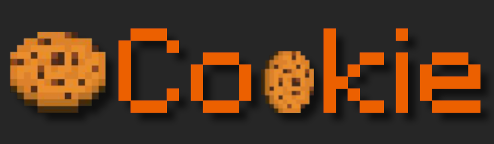

About Cookie
----

Cookie is a high-performance server of MCBE, written in Java, supports all features, and supports loading plug-ins. Cookie has a complete and easy-to-use plug-in api, which generally draws on the architecture of nk, and has made a lot of changes on this basis. This project is still under development. We welcome capable developers to join our development team (currently almost all of them are developed by me). We hope that through this project, we can revive the domestic bedrock version of the ecosystem.

Design goals
---
* All original features.
* Support original world format and can summon original terrain.
* Plugin is able to add new blocks, creatures, items, and synthesis tables (transfer Add-On api).
* Easy for developer writing plugins.

How to run server?
---
Just need to copy the jar file into a folder and run `java -jar {corename}.jar`

About plugin developing document?
---
We are still designing the core api, and we will write the developing document after finish the api as soon as possible.

I want to join the developing group,how to join?
---
We welcome developer join our group.If you want to join our group,please add the QQ group: 107533634.
